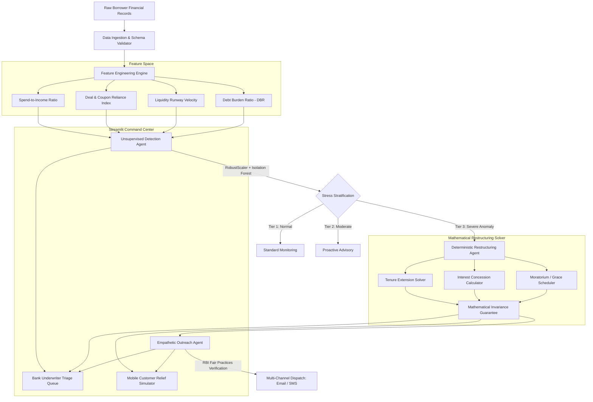

# FinSafe AI: Autonomous Financial Distress Detection & Debt Restructuring Engine

[](https://github.com/HarshidGiriver/The-Unorthodox/actions/workflows/ci.yml)
[](https://www.python.org/)
[](LICENSE)
[](https://www.rbi.org.in/)

FinSafe AI is an enterprise-grade intelligent platform designed for banking institutions and non-banking financial companies (NBFCs). It detects early, non-linear signals of borrower distress **before formal delinquency occurs**, calculates mathematically invariant debt restructuring plans, and dispatches dignified, empathetic customer outreach in strict compliance with the **Reserve Bank of India (RBI) Fair Practices Code for Lenders**.

---

## 🏛️ System Architecture



---
Architecture design :


## 🚀 Key Modules & Capabilities

### 1. 🔍 Unsupervised Stress Detection Agent (`src/agents/detection_agent.py`)
- Ingests non-linear behavioral proxies for distress (e.g. abrupt shifts toward emergency discount shopping, accelerating liquid buffer burn rate, rising credit card utilization).
- Leverages an unsupervised **Isolation Forest** fitted on scaled multidimensional features to isolate abnormal trajectories before credit bureau delinquency flags.
- Maps continuous anomaly decision scores to three operational tiers:
  - **Tier 1 (Normal / Low Risk)**: Stable cash flow profile.
  - **Tier 2 (Moderate Stress)**: Early liquidity tightening.
  - **Tier 3 (High Anomaly / Severe Distress)**: Immediate restructuring recommended.

### 2. 📐 Deterministic Debt Restructuring Agent (`src/agents/restructuring_agent.py`)
- Eliminates AI hallucination risk in loan servicing by using pure closed-form financial mathematics:
  $$\text{EMI} = \frac{P \cdot r \cdot (1+r)^n}{(1+r)^n - 1}$$
  where $P$ is outstanding principal, $r = \frac{\text{APR}}{12}$, and $n$ is repayment tenure in months.
- **Mathematical Invariance Guarantee**:
  $$\sum_{t=1}^{n} \text{Principal Repaid}_t = P, \quad \text{Ending Balance}_n = 0$$
- Solves for optimal tenure extensions (up to 36 months), interest concessions (up to 200 bps), and grace periods (1–6 months).

### 3. 🕊️ Empathetic Outreach Agent (`src/agents/outreach_agent.py`)
- Generates transparent, respectful communications in English and Hindi.
- **Strict RBI Fair Practices Code for Lenders (FPC) Compliance**:
  - Zero coercive, intimidating, or threatening language.
  - Contact timing enforcement (restricted strictly to permissible hours: **08:00 AM – 07:00 PM**).
  - Mandatory disclosure of revised tenure, new EMI, lifetime interest variance, and the official Bank Grievance Redressal Officer contact.

### 4. 💻 Command Center UI (`web/app.py`)
- **Bank Underwriter View**: Executive portfolio KPIs, Portfolio at Risk (PAR 30), risk stratification charts, filterable triage queue, and 1-click restructuring dispatch.
- **Customer Relief Simulator**: Mobile-responsive interactive portal with live EMI reduction calculators, month-by-month repayment curves, and statutory consent flows.

---

## 📂 Repository Layout

```
finsafe-ai/
├── .github/
│   └── workflows/
│       └── ci.yml                 # Automated linting & test pipeline
├── data/
│   ├── raw/                       # Original customer / campaign CSVs (gitignored)
│   └── processed/                 # Engineered features & stress indicators
├── models/
│   ├── isolation_forest.joblib    # Trained unsupervised anomaly model
│   └── scaler.joblib              # Fitted feature preprocessing pipeline
├── src/
│   ├── __init__.py
│   ├── config.py                  # Environment variables & constants
│   ├── train_models.py            # Model training & serialization pipeline
│   ├── agents/
│   │   ├── __init__.py
│   │   ├── detection_agent.py     # Unsupervised stress anomaly scoring
│   │   ├── restructuring_agent.py # Deterministic debt amortization solver
│   │   └── outreach_agent.py      # RBI-compliant empathetic LLM generator
│   ├── data/
│   │   ├── __init__.py
│   │   ├── loader.py              # CSV ingestion & type validation
│   │   └── feature_engineering.py # Stress index, deal reliance, spend-to-income
│   └── utils/
│       ├── __init__.py
│       └── metrics.py             # Portfolio-level risk metrics calculation
├── web/
│   ├── app.py                     # Main Streamlit command center entrypoint
│   ├── components/
│   │   ├── bank_view.py           # Underwriter triage queue & portfolio KPIs
│   │   └── customer_view.py       # Mobile customer relief simulator
│   └── styles/
│       └── custom.css             # Modern clean financial UI styling
├── tests/
│   ├── test_features.py           # Unit tests for stress feature calculations
│   └── test_restructuring.py      # Unit tests for loan mathematical invariance
├── notebooks/
│   └── 01_exploratory_stress.ipynb# Model validation & SHAP/anomaly plots
├── .env.example                   # Template for API keys (e.g., OPENAI_API_KEY)
├── .gitignore                     # Git exclusions
├── requirements.txt               # Pinned dependencies
├── pyproject.toml                 # Package definition & build configs
└── README.md                      # Comprehensive documentation
```

---

## ⚡ Quickstart Guide

### 1. Clone & Set Up Environment
```bash
git clone https://github.com/HarshidGiriver/The-Unorthodox.git
cd The-Unorthodox

# Create and activate virtual environment
python -m venv .venv
# On Windows:
.venv\Scripts\activate
# On Linux/macOS:
source .venv/bin/activate

# Install dependencies
pip install -r requirements.txt
```

### 2. Configure Environment Variables
```bash
cp .env.example .env
# Edit .env to add your OPENAI_API_KEY (optional, template fallback available)
```

### 3. Launch Streamlit Command Center
```bash
streamlit run web/app.py
```
Open your browser at `http://localhost:8501`.

### 4. Run Automated Test Suite
```bash
pytest tests/ -v
```

### 5. Retrain Anomaly Detection Models (Optional)
```bash
python src/train_models.py
```

---

## ⚖️ Regulatory Compliance & Disclaimers

FinSafe AI adheres to the following statutory and regulatory standards:
1. **RBI Fair Practices Code for Lenders (Circular DNBS.CC.PD.No. 266/03.10.01/2011-12)**.
2. **RBI Guidelines on Digital Lending (2022)**.
3. All restructuring recommendations represent simulated financial options subject to individual credit policy underwriting approval.

---

## 📄 License
This project is licensed under the MIT License — see the [LICENSE](LICENSE) file for details.
