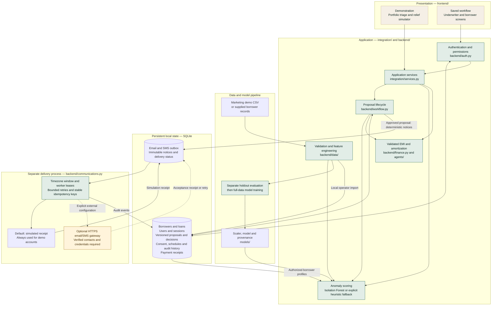

# Kintsugi AI

Streamlit application for borrower anomaly review and voluntary repayment proposals.

- **Demonstration:** marketing records with generated finances. Approval previews do not change accounts.
- **Saved workflow:** authenticated roles, SQLite storage, versioned proposals, review decisions, exact-term consent, local activation, delivery tracking and payment receipts.

This is a local prototype, not a core banking integration or certified compliance product. Anomaly indicators are not probabilities of default. Sample contacts are placeholders.

## Architecture

The UI and application services run in one Streamlit process. SQLite stores the saved workflow; a separate worker processes its notification outbox. Dashed connections below represent optional external delivery.



The demonstration previews do not persist approvals. Saved-workflow service methods enforce roles and account ownership on every action; the authentication node is not the sole authorization boundary. Approval queues notices independently of borrower consent and activation. Activation updates only the local loan schedule, and a gateway receipt means acceptance rather than confirmed inbox/handset delivery. No core banking connection is implemented.

## Run

Use Python 3.12–3.14 (locally verified on 3.14.7). Exact dependencies are in `requirements-lock.txt`.

```powershell
python -m venv .venv
.\.venv\Scripts\python.exe -m pip install -r requirements.txt
.\.venv\Scripts\python.exe -m streamlit run frontend/app.py
```

The demonstration requires no credentials or external API. Financial notices are deterministic; no LLM requests are made.

## Saved workflow setup

The database defaults to `~/.kintsugi/app.sqlite3`; override with `KINTSUGI_DB_PATH`. Keep it outside Git. Local operator commands:

```powershell
python -m backend.manage init-demo
python -m backend.manage create-user reviewer --role underwriter
python -m backend.manage create-user borrower5524 --role borrower --customer-id CUST-5524
python -m streamlit run frontend/app.py
```

Password prompts hide input; minimum length is 12 characters. Passwords use salted PBKDF2-SHA256. No default passwords exist. Sessions expire after one hour; five failed logins lock the username for five minutes. Choose **Application mode → Saved workflow** and sign in separately for each role.

Import real, validated data with `python -m backend.manage import-csv path/to/borrowers.csv`. Imports preserve existing accounts and never overwrite active loan state. See [data contract](docs/DATA_CONTRACT.md).

## Workflow

```text
Validated data → anomaly review → draft → underwriter decision
  → borrower reviews exact version → consent → local activation
  → receipts, delivery tracking and audit history
```

Saving and approving are separate actions. Approval requires all payments to fit monthly income after expenses. Approval queues notifications; it does not claim delivery. Borrowers see only their own approved/consented/active proposals. Consent stores the immutable terms hash. Activation verifies consent and loan version, updates the local schedule transactionally, and is idempotent.

Create a new draft to revise terms. Competing proposals cannot both activate against the same loan version. Further restructuring after activation, or after receipts exist, is blocked pending servicing reconciliation. Receipt totals are not reconciled principal balances or delinquency metrics.

## Communications

```powershell
python -m backend.communications --watch
```

Use `--once` for one eligible item. Default `DELIVERY_MODE=simulate` sends nothing and stores simulation receipts. Generated demo accounts always remain simulated.

For non-simulated accounts, verify contacts through your own process, then attest locally with `python -m backend.manage verify-contact CUSTOMER_ID --email ADDRESS --phone NUMBER`. Verify before approval because delivery snapshots are immutable.

External integration requires `DELIVERY_MODE=webhook`, an HTTPS `DELIVERY_WEBHOOK_URL`, and `DELIVERY_WEBHOOK_TOKEN`. The gateway accepts JSON `{channel, recipient, subject, body}`, bearer authorization and an `Idempotency-Key`. It must durably deduplicate that key and return `{receipt_id: "..."}` on both initial and repeated requests. No provider has been configured or contacted. **Sent** means gateway acceptance, not confirmed inbox/handset delivery.

The worker enforces the configured contact window using `CONTACT_TIMEZONE` (default Asia/Kolkata), `RBI_CALL_HOURS_START` and `RBI_CALL_HOURS_END` (legacy names; not a legal determination). It uses UTC leases, exponential retries, a five-attempt limit and five-minute crash recovery. Duplicate prevention after a timeout/crash depends on gateway idempotency. UI queue states and audit events distinguish simulated, sent, retry and failed results.

## Data and model evidence

The bundled CSV has 2,240 marketing records and 29 source columns. Attribution retained from the original project: [Customer Personality Analysis](https://www.kaggle.com/datasets/imakash3011/customer-personality-analysis). Verify upstream license terms before redistribution.

Income and category totals become monthly INR simulation inputs, without asserting verified source units. Identities, loans, savings, utilization and late days are generated. Missing Income is imputed. The baseline loan is INR 300,000, 14% APR, 24 months, EMI **14,403.86**, plus a final rounding adjustment.

```powershell
python -m backend.train_models
python -m backend.train_models --data path/to/observed_borrowers.csv
python -m backend.generate_visualizations
```

Training evaluates an independent 70/30 holdout before refitting final artifacts. With `snapshot_date`, it uses chronological splitting. Non-simulation inputs may supply observed 0/1 `observed_default` labels for precision, recall, F1 and ROC AUC. Operators must validate outcome horizons and leakage.

`models/isolation_forest.metadata.json` records dataset/artifact hashes, feature contract, dependency versions and evaluation. Loading verifies artifact pairing. Missing/incompatible artifacts produce a visible heuristic warning. Explicitly missing input paths fail; only an absent bundled CSV triggers labelled synthetic fallback.

Demo holdout: 1,568 training / 672 evaluation records; 15.625% model anomaly rate; 1.488% rules flag rate; 85.863% agreement. These are descriptive, not predictive accuracy. No observed defaults exist in this demo, and generated relationships partly determine anomaly separation.

## Code and checks

`frontend/` holds both modes and styles. `integration/services.py` constructs services. `backend/data/` validates and transforms input; `finance.py` and `agents/` calculate and score. `storage.py`, `auth.py`, `workflow.py` persist decisions. `communications.py`, `manage.py`, `observability.py` provide queue, operator and logging functions. `evaluation.py` and `train_models.py` record evidence.

```powershell
python -m pytest
python -m flake8 backend frontend integration tests --select=E9,F63,F7,F82
python -m build
python -m backend.manage health
```

The wheel includes data, models/metadata, images and CSS. Install it and run `kintsugi`. CI checks Python 3.12–3.14, tests, lint, build and installed-resource loading. Test success does not imply complete coverage.

CORS/XSRF protection is enabled. Remote deployment requires HTTPS and host/database access controls. SQLite targets a modest single-host deployment. Use SQLite-consistent backups. Logs omit borrower payloads and message bodies. No production hosting is configured.

See [implementation status](docs/IMPLEMENTATION_STATUS.md). `PROJECT_ANALYSIS.md` remains the historical pre-change audit.
